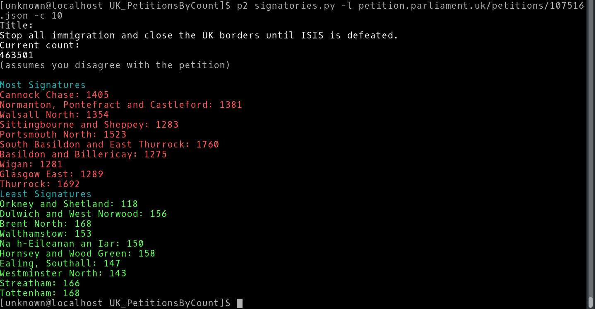

UK Petitions: by signature count 
=====================
(Or, "Tw^tFinder: Geolocating Tw^ts by Petition Signature counts)

Description
-----------

UK Petition data are exposed in JSON format; signatories.py lists the top and bottom 5 
constituencies by signature count and default outputs are colour coded with the assumption 
you disagree with the petition (worst offenders as most signatures in red, etc)

Usage
-----

Go to https://petition.parliament.uk/petitions and select a petition to view.  At the base of 
the petition page, before the page footer, you will find a link named 'Get petition data 
(json format)'.  Copy this link and proceed as follows:

python signatories.py -l $site_link

OPTIONS:  
   -l $site_link (URL to petition JSON, REQUIRED)  
   -c $count (Number of desired return values, default is 5)  
   --agree (If you wish to switch colouration to highlight most signatures as GREEN (not 
required, petty))

##Example: Tw*ts Located!
  
Dependencies
------------

Python 2.x and the following libs:

argparse, json, operator, requests

Enjoy!
======

